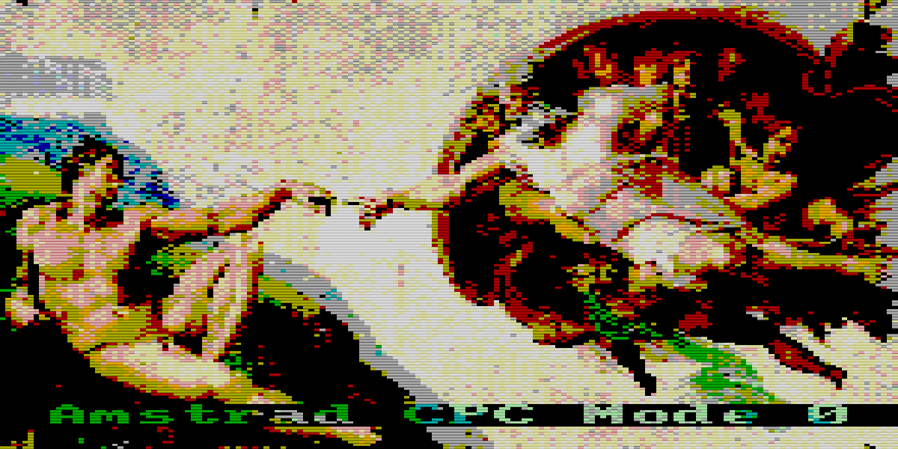
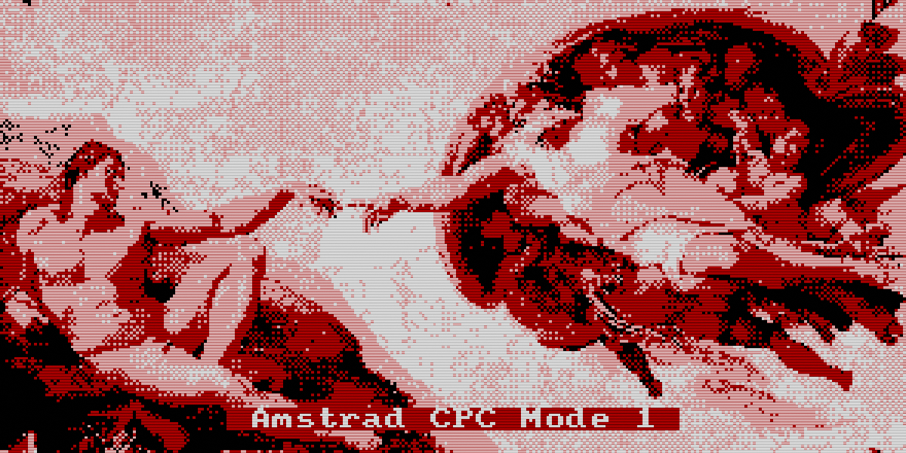
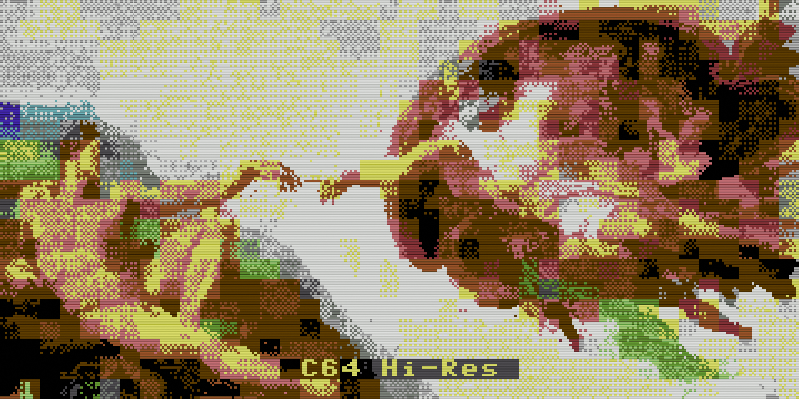
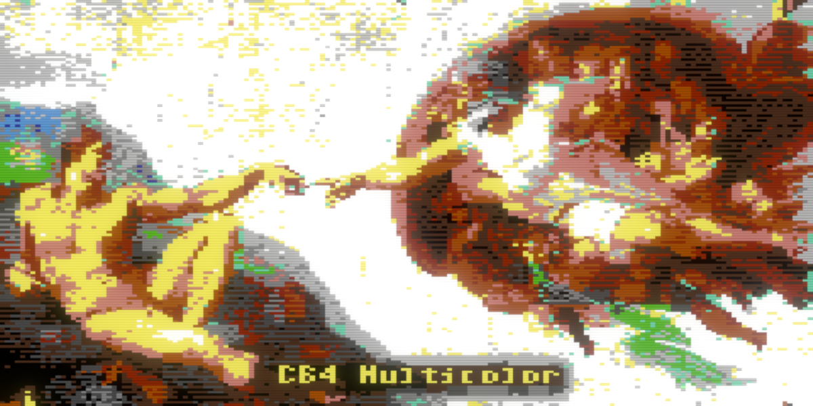
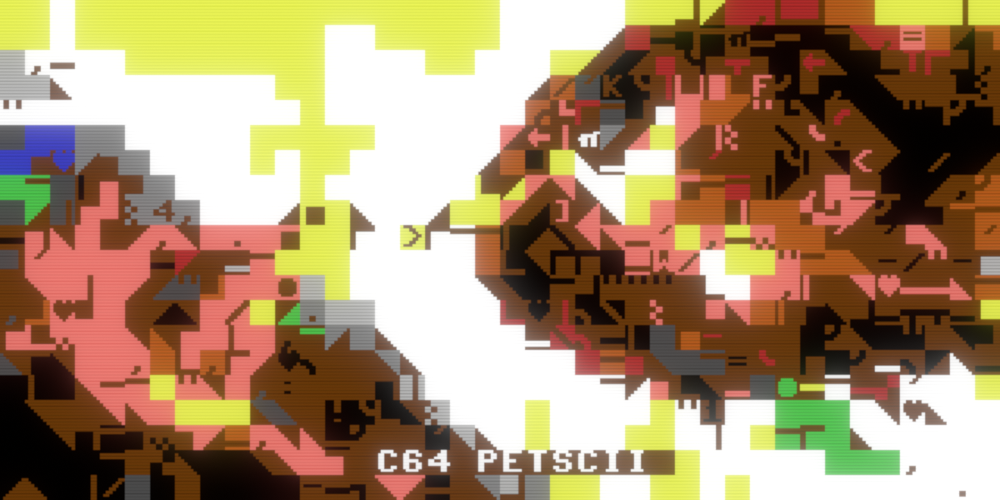
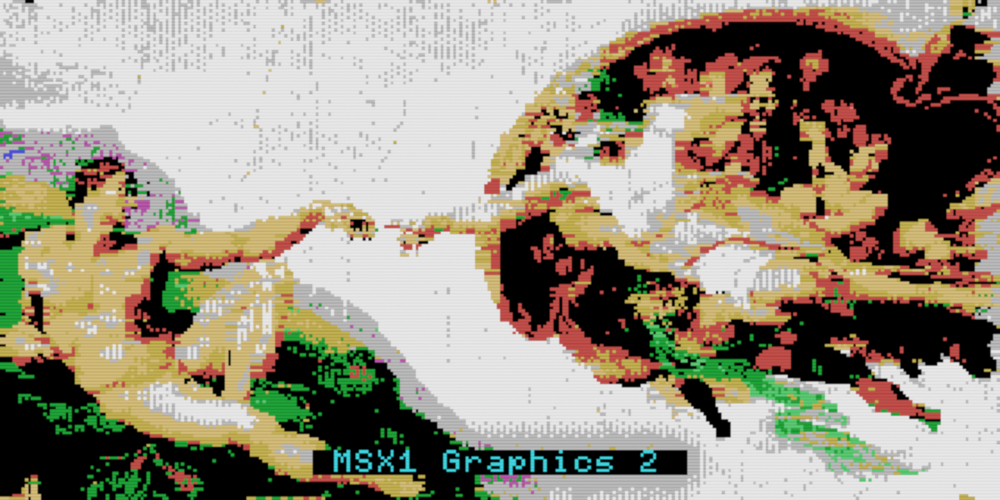
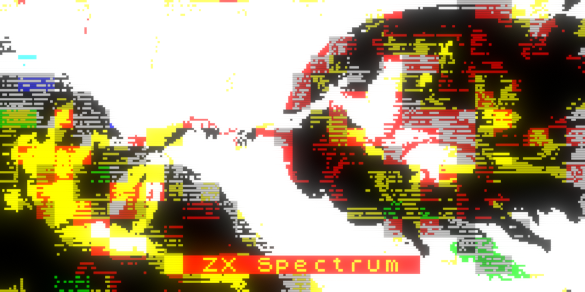

# Pieces-of-8-bit
An 8-bit retro graphics compositor for Blender 5+

**Pieces of 8-bit** is a retro graphics compositor for Blender. If you grew up with a ZX Spectrum, a Commodore 64, an Amstrad CPC, or an MSX, this tool lets you relive that magic - right inside Blender.

Built on a series of Geometry Nodes modifiers, Pieces of 8-bit works like a mini Photoshop for 8-bit hardware. A canvas modifier sets your screen resolution and border size, layer modifiers let you stack images, videos, text and color gradients, and a converter modifier handles the final conversion to authentic hardware palettes and color restrictions. Contextual gizmos make transforms intuitive, just like you'd expect from any modern graphics tool.

## Features
- ***Three layer types*** - image/video, text, color gradient (linear and radial)
- ***Transform*** - scale, rotate, offset (including character snapping)
- ***Effects*** - stroke, drop shadow, custom scalable dither patterns, blur
- ***Transitions*** - dissolve and byte-by-byte / character-by-character transitions
- ***Color*** - blend mode, alpha, brightness, contrast, hue, saturation, tint
- ***Masks*** - use RGBA channels of images and videos, or scene objects, as layer masks. Soften mask edges and preview them with a single click
- ***5 included fonts*** - with support for any additional TTF or OTF font
- ***Transparent canvas*** - for retro designs without the constraints of a rectangle background & border
- ***Natively animatable parameters*** - create animations using Blender's built-in tools, and render them to standard video formats
- ***Export*** - save images in native file formats of each supported machine. Load your creations in emulators, on real hardware, or import them into compatible drawing apps, like Multipaint, for further editing:

## Supported Machines and Export Formats
- ***Amstrad CPC*** - modes 0 and 1 (.dsk)
- ***Commodore 64*** - hi-res, multicolor and PETSCII (.art, .kla, .ocp, .prg)
- ***MSX1*** - graphics 2 mode (.sc2, .dsk)
- ***ZX Spectrum*** (.scr, .tap)

## Getting Started
- Download the .zip file and extract the .blend file
- Open it in Blender 5 or later
- Usage instructions are available inside the file

## Credits
- ***Style64*** - [C64 TrueType](http://www.style64.org/c64-truetype) font
- ***Patrick H. Lauke*** - [MSX International+](https://www.fontstruct.com/fontstructions/show/2310019) font
- ***Tóth Krisztián*** - C64 palettes sampled from Krissz's excellent [PETSCII editor](https://www.petscii.krissz.hu)

## License
This work is licensed under [CC BY-NC 4.0](https://creativecommons.org/licenses/by-nc/4.0/). Free to use including for commercial work, but selling it is prohibited. You're welcome to share it, but please direct people to download it from the original source rather than redistributing the files directly. Made something with it? Tag me - I'd love to see it!

## Links
[Videos & designs on Instagram](https://www.instagram.com/uri.inbar/)  
[Gumroad page](https://uriinbar.gumroad.com/l/djgraf)  
[itch.io page](https://uri-inbar.itch.io/pieces-of-8-bit)  
[Redbubble store](https://www.redbubble.com/people/uri-inbar/shop) 
